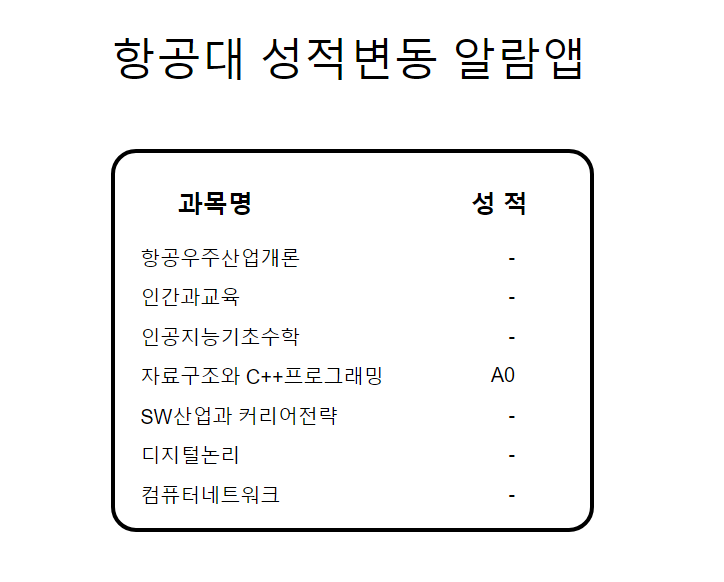

# 항공대 성적 변동 알림이

## 2020/07/01 주요 작업내용
- Puppeteer 를 사용해서 크롤링한 데이터를 Express 로 서버에 올림
- React 프로젝트에서는 해당 데이터를 Fetch 함.

### 07/01 - 버그 / 새로 알게 된 내용
- getSubjectList() 라는 과목 리스트를 만드는 함수 중, (객체 A) = {...A, 추가할 내용} 으로 분해 할당을 수행하면 객체가 가진 기존의 값이 "갱신" 되는 객체의 구조 분해 할당과 다르게 배열에서는 언제나 새로운 값이 추가된다는 점을 알 수 있었다.   

- 그래서 getSubjectList() 함수를 호출할 때마다 과목명이 계속해서 늘어나는 문제가 있었는데, 이를 과목 배열이 비어있을  동작하도록 조건을 설정해 문제를 해결할 수 있었다.

## 2020/07/02 주요 작업내용
- Concurrently 와 nodemon 라이브러리를 사용, 서버와 프론트 실행이 동시에 수행될 수 있도록 편의성 개선
- CSS 일부 적용

### 07/02 - 버그 / 새로 알게 된 내용
- 기존에는 node Server / npm run start 라고 두 개의 터미널에서 각각 다른 명령어를 실행하는게 불편했는데, concurrently 라는 라이브러리를 통해 두 개의 명령어를 동시에 수행하는 방법을 알 수 있었다.
- 또, nodemon 이라는 라이브러리를 통해 파일에 변경이 생길 때마다 서버를 재실행하는 라이브러리를 통해 live server 익스텐션처럼 변동사항을 그때그때 반영할 수 있도록 하였다.

---

---
